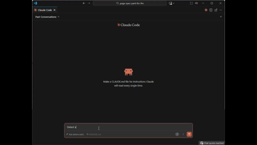

# Page-Spec YAML

Structured UI specifications designed for AI-assisted development.

<!-- TODO: Add article link when published -->

## Why This Exists

Natural language is great for explaining intent but terrible for specifying UI behavior. This YAML format was designed collaboratively with AI to be unambiguous — a shared, structured language both humans and LLMs can parse precisely.

## Usage

This project is a template. Copy the `page-specs/` folder into your real project — that works better than standalone. When the specs live alongside your code, the AI can reference your existing components, styles, and patterns when generating implementations.

The included specs define an **example e-commerce store** — product browsing, cart, checkout, user accounts, and admin dashboards. Use these as a reference for the format, then delete and replace them with your own application's pages and flows.

### Example Prompts

**Generate a component from a spec:**

```text
Using @page-specs/pages/cart.ui.yaml generate a React component with TypeScript and Tailwind CSS.
```

The AI reads the spec, understands the structure (sections, components, data bindings), and outputs a working component that matches your spec exactly.

**Create a new page spec:**

```text
Create the pages and incorporate the flow for a "Wishlist" capability.
```

The AI creates a new `.ui.yaml` file following your existing conventions — same structure, same component types, consistent with the rest of your specs.

**Generate tests from a flow:**

```text
Read @page-specs/flows/02.00-browse-and-purchase.flow.yaml and generate Playwright E2E tests for the happy path.
```

The AI traces through the flow steps, understands the user journey, and outputs tests that cover each step with proper assertions.

See [prompts.txt](prompts.txt) for more examples.

## Getting Started

### Prerequisites

Install [Node.js](https://nodejs.org/) (LTS version recommended). This also installs npm.

Then install pnpm:

```bash
npm install -g pnpm
```

### View the Spec Browser

From the project root:

```bash
pnpm run docs
```

Open <http://localhost:3000> to browse all specs interactively.


### Validate Your Specs

```bash
pnpm run lint
```

This validates all specs against their JSON schemas (`page-specs/schemas/`). The linter runs three checks in parallel:

- `lint:pages` — validates `*.ui.yaml` files
- `lint:flows` — validates `*.flow.yaml` files
- `lint:layouts` — validates `*.layout.yaml` files

When validation fails, you'll see the file path and error details. To fix errors, prompt your AI with something like:

```text
Run pnpm run lint, then fix any validation errors in the page specs.
```

The AI will read the error output, locate the invalid properties, and update the YAML to conform to the schema.



## Directory Structure

```text
page-specs/
├── schemas/          # JSON Schema definitions
├── layouts/          # Shared layouts (header, footer, nav)
│   └── *.layout.yaml
├── pages/            # Individual page specifications
│   └── *.ui.yaml
├── flows/            # Multi-page user journeys
│   └── *.flow.yaml
└── index.html        # Interactive spec viewer
```

## Workflow

Use AI prompts to create and modify specs — see [prompts.txt](prompts.txt) for examples. The YAML is designed to be maintained by AI, not written by hand (though small tweaks are fine).

For VS Code autocomplete and validation, install the [YAML extension](https://marketplace.visualstudio.com/items?itemName=redhat.vscode-yaml).

## License

MIT
